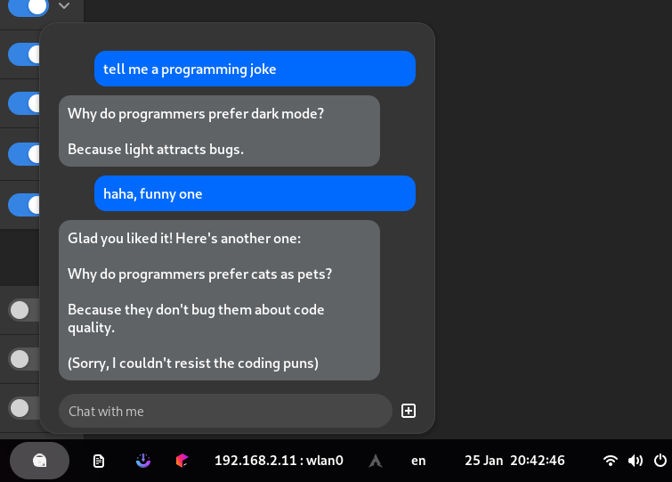

# Penguin: AI Chatbot (ollama edition)

A GNOME extension that uses ollama to provide a minimal AI chat.
Fork of [Penguin-AI-Chatbot-for-GNOME](https://gitlab.com/martijara/Penguin-AI-Chatbot-for-GNOME)



# Quick install

```bash
curl 'https://raw.githubusercontent.com/ArjixWasTaken/penguin/refs/heads/main/install.sh' | bash
```
